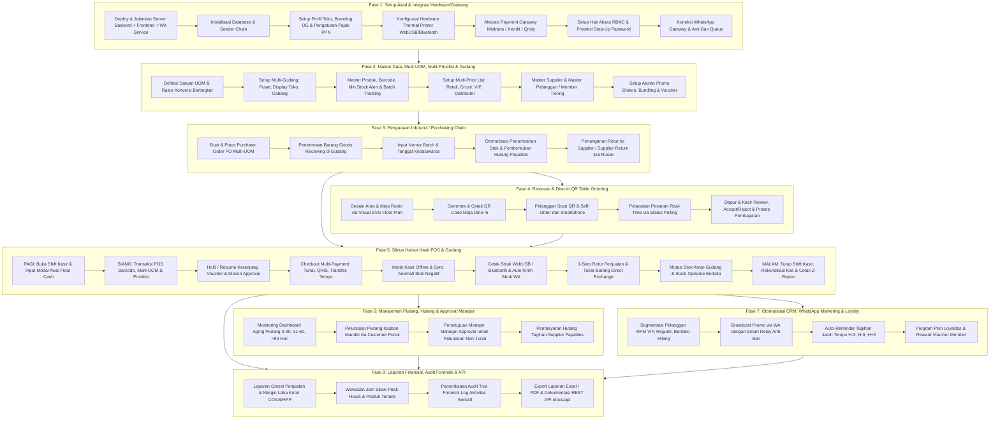
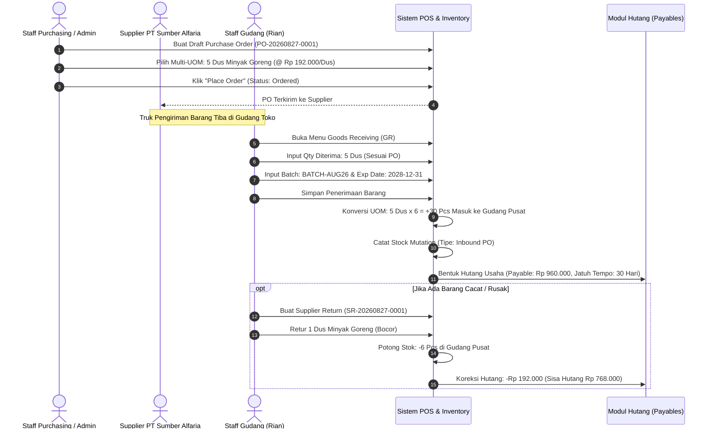
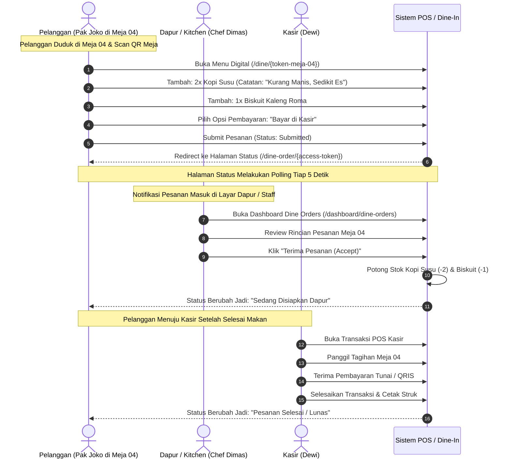
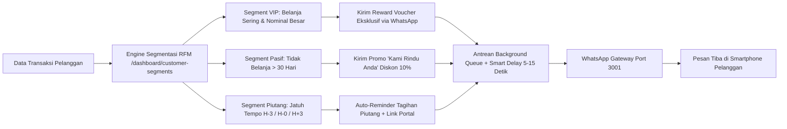

# Panduan Simulasi & Urutan Operasional Lengkap Point of Sales

Dokumen ini adalah panduan alur kerja menyeluruh (*end-to-end operational simulation guide*) sistem POS (Point of Sales & Resto). Panduan ini dirancang untuk mendemonstrasikan seluruh fitur sistem secara praktis, realistis, dan berurutan—mulai dari konfigurasi awal sistem, setup master data multi-level, siklus pengadaan barang (*purchasing chain*), operasional *Dine-In QR Table Ordering*, rutinitas harian kasir & gudang, manajemen piutang & hutang dengan alur persetujuan manajer, otomatisasi CRM & WhatsApp marketing, hingga analisis finansial dan audit forensik.

---

## 🗺️ Peta Alur Operasional (End-to-End Architecture)



---

## 🎭 Skenario Kasus Bisnis (*Role-Play Scenario*)

Untuk membuat simulasi terasa nyata, kita menggunakan studi kasus bisnis: **"CV Berkah Jaya & Resto Corner"**, sebuah entitas usaha *hybrid* yang mengoperasikan toko ritel/grosir sekaligus area kafe *dine-in*.

### Profil Karakter Pengguna (*Actors & Roles*):
| Aktor | Role Sistem | Kredensial Login | Tugas Pokok |
|---|---|---|---|
| **Budi Santoso** | `Super Admin` / Owner | `admin@mail.com` / `password` | Konfigurasi sistem, approval finansial, audit log, laporan laba rugi. |
| **Siti Rahma** | `Admin` / Inventory Head | `admin@mail.com` / `password` | Master data barang, UOM, harga bertingkat, PO supplier, stock opname. |
| **Dewi Kasir** | `Cashier` | `cashier@gmail.com` / `password` | Buka/tutup shift, transaksi kasir POS, hold/resume cart, cetak struk thermal. |
| **Rian Gudang** | `Warehouse Staff` | `admin@mail.com` (Role Gudang) | Penerimaan barang masuk (Goods Receiving), mutasi transfer antar-gudang. |
| **Chef Dimas** | `Kitchen / Waiter` | `cashier@gmail.com` (Akses Dine-In) | Monitor antrean pesanan meja Dine-In, konfirmasi/accept orderan makanan. |
| **Pak Joko** | `Customer Member VIP` | *Scan QR Meja / Member #081234567890* | Pembeli retail/grosir & pelanggan kafe dine-in. |

---

## 🛠️ Fase 1: Setup Awal, Hardware & Integrasi Gateway

Langkah ini dilakukan sekali pada saat sistem pertama kali diinisialisasi atau diterapkan pada toko baru.

### 1. Menjalankan Server & Environment Pendukung
Sistem membutuhkan server backend Laravel, dev server Vite HMR, dan background service WhatsApp:
```bash
# 1. Setup file environment & dependensi
cp .env.example .env
composer install && npm install
php artisan key:generate
php artisan migrate --seed (PermissionSeeder, RoleSeeder, UserSeeder, PaymentSettingSeeder, SampleDataSeeder, OperationalCoreSeeder, FeatureCoverageSeeder)
php artisan storage:link

# 2. Jalankan Dev Server (Buka 2 Terminal terpisah)
npm run dev          # Terminal 1: Vite Frontend HMR
php artisan serve    # Terminal 2: Laravel Backend Server (http://localhost:8000)

# 3. (Opsional) Jalankan WhatsApp Gateway Service
cd whatsapp-service && npm install && npm start   # Terminal 3: Port 3001

# 4. (Opsional) Sinkronisasi Master Katalog Produk Referensi (32k+ Produk Indonesia)
php artisan catalog:sync-google-sheet
```

> [!NOTE]
> Urutan seeder database berjalan otomatis:
> `PermissionSeeder` → `RoleSeeder` → `UserSeeder` → `PaymentSettingSeeder` → `SampleDataSeeder` → `OperationalCoreSeeder` → `FeatureCoverageSeeder`.

### 2. Konfigurasi Profil Toko, Branding & Pajak (PPN)
1. Buka browser dan login sebagai Superadmin: `admin@mail.com` / `password`.
2. Masuk ke menu **Pengaturan > Identitas Toko (`/dashboard/settings/store`)**:
   - **Nama Toko**: `Berkah Jaya & Resto Corner`
   - **No. Telepon**: `081298765432` | **Email**: `kontak@berkahjaya.com`
   - **Alamat**: `Jl. Sudirman No. 88, Jakarta Selatan`
   - **Header Struk**: `Selamat Datang di Berkah Jaya`
   - **Footer Struk**: `Barang yang sudah dibeli dapat ditukar maksimal 3 hari dengan menyertakan struk.`
   - **Target Penjualan Bulanan**: `Rp 150.000.000`
3. Masuk ke **Pengaturan > Pajak & Legalitas (`/dashboard/settings/tax`)**:
   - **Tarif Pajak PPN**: `11%` (atau `12%` sesuai regulasi).
   - **Mode Pajak**: Pilih *Tax Exclusive* (pajak ditambahkan di nota) atau *Tax Inclusive* (harga tertera sudah termasuk pajak).
   - **Nomor NPWP & NIB**: Isi untuk keperluan faktur formal.
4. **Dynamic Open Graph Preview (`/og-image.png`)**:
   - Logo dan warna primer toko otomatis terintegrasi menjadi preview banner media sosial saat tautan toko dibagikan ke WhatsApp/Telegram.

### 3. Konfigurasi Hardware Printer Struk (WebUSB / Bluetooth / ESC-POS)
Buka menu **Pengaturan > Printer (`/dashboard/settings/printer`)**:
1. **Ukuran Kertas**: Pilih `80mm` (lebar 48 karakter) atau `58mm` (lebar 32 karakter).
2. **Default Print Driver**:
   - `WebUSB Direct`: Mencetak langsung ke printer thermal USB tanpa dialog browser (khusus browser Chrome/Edge desktop).
   - `Web Bluetooth`: Mencetak langsung via Bluetooth LE dari smartphone/tablet (PWA / Mobile POS).
   - `Browser Print`: Menggunakan dialog cetak standar sistem operasi.
   - `Server ESC/POS`: Mencetak via driver network LAN printer.
3. **Tombol Tampil**: Aktifkan checkbox untuk menampilkan tombol *Quick Print (USB/Bluetooth/PDF)* di halaman transaksi kasir.
4. Lakukan **Uji Cetak (*Test Print*)** untuk memastikan koneksi printer terhubung sempurna.

### 4. Setup Payment Gateway & Rekening Bank Toko
1. **Payment Settings (`/dashboard/settings/payments`)**:
   - **Midtrans / Xendit**: Masukkan *Server Key*, *Client Key*, dan *Webhook Secret*.
   - **Qrisly QRIS Dinamis**: Masukkan API credentials untuk pembayaran QRIS instan.
   - **Auto-Restock Webhook**: Aktifkan fitur otomatis kembalikan stok (*auto-restock*) jika pembayaran digital pelanggan kedaluwarsa (*expired*).
2. **Rekening Bank Toko (`/dashboard/settings/bank-accounts`)**:
   - Daftarkan rekening penerimaan: `Bank BCA (No: 8820192831 a/n Berkah Jaya)` dan `Bank Mandiri (No: 137001928392 a/n Berkah Jaya)`.

### 5. Setup Keamanan RBAC & Proteksi Step-Up Password
1. **Roles & Permissions (`/dashboard/roles`, `/dashboard/permissions`)**:
   - Sistem memiliki role terintegrasi: `Super Admin`, `Admin`, `Cashier`, `Warehouse Staff`, `Kitchen Staff`, `Accountant`.
2. **Proteksi Step-Up Password (`step_up` middleware)**:
   - Aksi sensitif (mengubah permission role, mengedit kredensial payment gateway, menambah rekening bank, atau approve diskon besar) mewajibkan konfirmasi password ulang kasir/admin demi mencegah pembajakan akun saat kasir sedang ditinggal.

### 6. Aktivasi WhatsApp Gateway & Anti-Ban Queue Protection
Buka menu **Pengaturan > WhatsApp (`/dashboard/settings/whatsapp`)**:
1. Pastikan service Node.js aktif di `http://localhost:3001`.
2. Klik tombol **Hubungkan WhatsApp**, sistem memunculkan QR Code live.
3. Buka aplikasi WhatsApp di HP toko → *Perangkat Tertaut* → *Tautkan Perangkat* → *Scan QR*.
4. Status berubah menjadi **Connected** dengan nomor telepon terdaftar.
5. **Anti-Ban Smart Delay**: Sistem secara otomatis menjadwalkan pengiriman pesan promosi dan struk melalui antrean background khusus (*Dedicated WhatsApp Queue*) dengan *random jitter delay* 3–7 detik per pesan agar nomor toko tidak terblokir oleh sistem keamanan WhatsApp.

---

## 📦 Fase 2: Master Data, Satuan Multi-UOM, Multi-Pricelist & Gudang

### 1. Satuan & Konversi Bertingkat (UOM)
Buka menu **Master Data > Satuan (`/dashboard/units`)**:
Daftarkan hierarki satuan barang:
- `Pcs` (Satuan dasar = 1)
- `Pack` (Faktor konversi = 10 Pcs)
- `Dus / Karton` (Faktor konversi = 24 Pcs)
- `Porsi` / `Cup` (Satuan saji restoran = 1)

### 2. Setup Multi-Gudang (Warehouse)
Buka menu **Pengaturan > Gudang (`/dashboard/settings/warehouses`)**:
- `Gudang Pusat (Main Warehouse)`: Tempat bongkar muat barang masuk dari supplier.
- `Toko Display (Front Store)`: Lokasi rak pajangan tempat kasir bertransaksi.
- `Resto Pantry / Kitchen`: Lokasi penyimpanan bahan baku makanan & minuman.

### 3. Master Produk, Barcode & Katalog Referensi (32k+ Data)
Buka menu **Produk (`/dashboard/products`)**:

Sistem menyediakan database bawaan **Katalog Produk Referensi (32.000+ data barang di Indonesia)** agar proses input produk baru berjalan sangat cepat tanpa mengetik manual.

#### A. Sinkronisasi Master Katalog Referensi (Opsional / Admin Setup)
Jika ingin memperbarui atau menyinkronkan ulang database referensi produk dari Google Sheets:
1. Pastikan URL Google Sheet CSV sudah terpasang di file `.env`:
   ```env
   GOOGLE_SHEET_CATALOG_URL="https://docs.google.com/spreadsheets/d/YOUR_SHEET_ID/export?format=csv&gid=0"
   ```
2. Jalankan perintah artisan:
   ```bash
   php artisan catalog:sync-google-sheet
   # Atau dengan URL kustom:
   php artisan catalog:sync-google-sheet --url="https://docs.google.com/spreadsheets/d/XXX/export?format=csv&gid=0"
   ```
   > **Format Kolom CSV:** `KODE_BARCODE`, `NAMA`, `KODE_BARANG`, `KATEGORI`, `SATUAN_1`, `HPP`, `HARGA_TOKO_1`, `SUPPLIER`.

#### B. Menambahkan Produk Menggunakan Katalog Referensi
1. Buka halaman **Tambah Produk (`/dashboard/products/create`)**.
2. **Cara 1 (Scan / Ketik Barcode):** Masukkan barcode pada kolom *Barcode*. Jika produk ada di katalog referensi, sistem otomatis mengisi Nama Produk, Kategori, Satuan, dan Estimasi Harga.
3. **Cara 2 (Pencarian Katalog):** Klik tombol **"Cari di Katalog Referensi (32k+ Data)"** di bagian kanan atas $\rightarrow$ cari berdasarkan nama/merek/barcode $\rightarrow$ klik produk yang sesuai.
4. Sesuaikan harga beli (HPP), harga jual toko, stok awal, dan foto produk, lalu klik **Simpan**.

#### C. Contoh Master Produk Toko:

| Nama Produk | Kategori | Barcode / SKU | Satuan | Harga Beli (HPP) | Harga Jual Retail | Min Stock | Gudang |
|---|---|---|---|---|---|---|---|
| **Minyak Goreng Sania 2L** | Sembako | `8992753123456` | Pcs, Dus (1 Dus=6 Pcs) | Rp 32.000 / Pcs | Rp 38.000 / Pcs | 12 Pcs | Gudang Pusat |
| **Kopi Susu Gula Aren** | Minuman | `MENU-KOPISUSU` | Cup / Porsi | Rp 6.000 / Cup | Rp 18.000 / Cup | 20 Cup | Resto Pantry |
| **Biskuit Kaleng Roma** | Makanan Ringan | `8991001200300` | Pcs, Box (1 Box=12 Pcs) | Rp 15.000 / Pcs | Rp 20.000 / Pcs | 10 Pcs | Toko Display |

> [!TIP]
> **Quick Add di Layar Kasir POS (`/pos`):** Saat kasir melakukan scan barcode produk baru yang belum ada di database toko, sistem otomatis mencari barcode di katalog referensi dan memunculkan modal **Quick Add Product** dengan data yang sudah terisi otomatis. Kasir/admin cukup konfirmasi harga & stok awal untuk langsung menjualnya.

### 4. Setup Multi-Price List (Daftar Harga Bertingkat)
Buka menu **Pengaturan > Daftar Harga (`/dashboard/settings/price-lists`)**:
Buat kelompok harga untuk segmentasi pelanggan yang berbeda:
1. **Harga Retail (Default)**: Minyak Goreng = `Rp 38.000`.
2. **Harga Grosir / Toko Kelontong**: Minyak Goreng = `Rp 35.000` (min. pembelian 1 Dus).
3. **Harga Member VIP**: Diskon khusus 5% atau harga Rp `36.000`.
4. **Harga Online Food Channel (GoFood/GrabFood)**: Kopi Susu = `Rp 22.000`.

### 5. Master Supplier & Pelanggan / Member Tiering
1. **Master Supplier (`/dashboard/suppliers`)**:
   - Nama: `PT Sumber Alfaria Distribusi` | Kontak: `081122334455` | Termin: `Net 30 Hari`.
2. **Master Pelanggan & Member (`/dashboard/customers`, `/dashboard/members`)**:
   - Nama: `Pak Joko Widodo` | No. HP: `081234567890`
   - Tier: `VIP Gold` (Mendapatkan poin cashback 2% dari tiap transaksi + diskon otomatis).

### 6. Promosi, Diskon Berjenjang & Voucher
Buka menu **Promosi (`/dashboard/pricing-rules`, `/dashboard/customer-vouchers`)**:
1. **Rule Diskon Kuantitas (*Quantity Breaks*)**: Beli biskuit >= 5 Pcs dapat potongan Rp 1.000/Pcs.
2. **Rule Bundling**: Beli 2 Kopi Susu + 1 Biskuit Kaleng hemat Rp 5.000.
3. **Customer Voucher**: Kode `HEMAT10` (Potongan Rp 10.000 untuk transaksi minimal Rp 100.000).

---

## 🚚 Fase 3: Pengadaan Inbound / Purchasing Chain

Siklus pengadaan barang dari supplier untuk memastikan stok toko selalu terisi dengan pencatatan akuntansi hutang yang tertib.



### Langkah Simulasi Pengadaan:
1. **Buat Purchase Order (`/dashboard/purchase-orders/create`)**:
   - Pilih Supplier: `PT Sumber Alfaria Distribusi`.
   - Pilih Gudang Tujuan: `Gudang Pusat`.
   - Pilih Item: `Minyak Goreng Sania 2L`, Satuan: `Dus`, Qty: `5`, Harga: `Rp 192.000/Dus`. Total = `Rp 960.000`.
   - Klik **Simpan Draft**, lalu klik **Place Order** (`status: ordered`).
2. **Penerimaan Barang / Goods Receiving (`/dashboard/goods-receivings/create`)**:
   - Pilih nomor PO terkait (`PO-20260827-0001`).
   - Masukkan kuantitas riil yang diterima: `5 Dus`.
   - Isi **Batch Number**: `BATCH-AUG26` dan **Expired Date**: `31/12/2028`.
   - Klik **Simpan Penerimaan**.
   - *Hasil Sistem*: Stok di Gudang Pusat bertambah **30 Pcs**, tercatat di `StockMutation`, dan terbentuk data **Hutang Usaha (Payable)** sebesar `Rp 960.000` dengan jatuh tempo 30 hari ke depan.

---

## 🍽️ Fase 4: Restoran & Layanan Meja (Dine-In QR Table Ordering)

Fitur khusus untuk restoran, kafe, atau pujasera yang memungkinkan pelanggan memesan makanan dari meja secara mandiri melalui pemindaian QR code tanpa antre.



### Langkah Simulasi Dine-In:
1. **Setup Area & Meja (`/dashboard/dine-areas`, `/dashboard/dine-tables`)**:
   - Buat Area: `Area Indoor AC` dan `Area Outdoor Garden`.
   - Buat Meja: `Meja 01`, `Meja 02`, `Meja 04` (Kapasitas: 4 orang, Bentuk: Persegi).
   - Gunakan **Floor Plan Editor (SVG Drag & Drop Grid)** untuk menata letak meja sesuai denah restoran fisik.
   - Klik **Unduh QR Code Meja (`/dashboard/dine-tables/{id}/qr`)** dan cetak untuk ditempel pada meja fisik.
2. **Simulasi Pelanggan Memesan (Self-Order)**:
   - Buka tautan menu meja (misal: `http://localhost:8000/dine/{token-meja-04}`).
   - Pelanggan melihat antarmuka menu *mobile-friendly* dengan foto produk, kategori, dan harga.
   - Pilih `2x Kopi Susu Gula Aren`, tambahkan catatan: *"Less Sugar, Sedikit Es"*.
   - Pilih opsi pembayaran: **Bayar di Kasir (*Pay at Counter*)** atau **Bayar Online (*Midtrans/Xendit/Qrisly*)**.
   - Klik **Kirim Pesanan**. Pelanggan diarahkan ke layar pelacakan live (`/dine-order/{accessToken}`) dengan polling otomatis tiap 5 detik.
3. **Pemrosesan di Dapur & Kasir**:
   - Chef Dimas membuka **Dine Orders (`/dashboard/dine-orders`)**.
   - Pesanan Meja 04 muncul dengan status *Pending/Submitted*.
   - Klik **Terima Pesanan (*Accept*)**: Stok bahan terpotong otomatis di sistem gudang pantry.
   - Setelah makan selesai, kasir Dewi membuka POS, memproses pelunasan pesanan Meja 04, dan mencetak struk thermal.

---

## ⚡ Fase 5: Siklus Harian Kasir POS, Offline Sync & Tukar Barang

Alur operasional kasir dari toko buka di pagi hari hingga toko tutup di malam hari.

### 1. Pagi Hari: Pembukaan Shift Kasir (*Shift Opening*)
1. Kasir Dewi login ke sistem: `cashier@gmail.com` / `password`.
2. Klik menu **Kasir POS (`/pos`)**.
3. Sistem memblokir layar kasir (*Active Shift Guard*) dan memunculkan pop-up **Buka Shift Baru**.
4. Masukkan **Modal Kas Awal (*Opening Cash Float*)**: `Rp 200.000` (uang pecahan kembalian di laci kas).
5. Pilih Gudang Kasir: `Toko Display`.
6. Klik **Buka Shift**. Layar kasir sekarang aktif dan siap bertransaksi.

### 2. Operasional Penjualan Kasir (POS Checkout)
Ketika pembeli (Pak Joko) datang membawa barang ke kasir:
1. **Identifikasi Pelanggan & Pricelist**:
   - Ketik nama `Pak Joko` atau nomor HP `081234567890`.
   - Sistem mendeteksi status **VIP Gold**: harga otomatis mengacu pada *Price List VIP*, serta menampilkan saldo poin loyalitas (`1.500 Poin = Rp 15.000`).
2. **Scan / Input Barang**:
   - Scan barcode `8992753123456` (Minyak Goreng).
   - Pilih Satuan: `Dus` (berisi 6 Pcs) dengan harga grosir khusus.
   - Tambah 1x Biskuit Kaleng Roma.
3. **Penerapan Diskon & Voucher**:
   - Input voucher diskon: `HEMAT10` (Potongan langsung Rp 10.000).
   - Tukar 1.000 poin loyalitas untuk potongan ekstra Rp 10.000.
4. **Fitur Antrean: Hold & Resume Keranjang**:
   - Jika Pak Joko lupa mengambil dompet di mobil, kasir klik **Tahan Keranjang (*Hold Cart*)** dengan label *"Pak Joko - Ambil Dompet"*.
   - Kasir melayani antrean pelanggan berikutnya tanpa kehilangan data transaksi Pak Joko.
   - Saat Pak Joko kembali, kasir klik **Lanjutkan (*Resume Cart*)**.
5. **Pilihan Metode Pembayaran**:
   - **Tunai (*Cash*)**: Total tagihan Rp 215.000, uang diterima Rp 250.000 → Kembalian otomatis terhitung Rp 35.000.
   - **QRIS Dinamis**: Tampilkan QR code di layar / EDC untuk di-scan m-Banking pelanggan.
   - **Transfer Bank**: Pilih rekening BCA toko (memerlukan Step-Up password untuk konfirmasi).
   - **Piutang / Kasbon (*Pay Later*)**: Khusus member terpercaya, tagihan masuk ke modul piutang dengan tanggal jatuh tempo.
   - **Split Payment**: Rp 100.000 Tunai + Rp 115.000 QRIS.
6. **Selesaikan Transaksi & Cetak Struk**:
   - Klik **Bayar**. Printer termal (WebUSB/Bluetooth) langsung mencetak struk secara otomatis (*Auto-Print*).
   - WhatsApp Gateway otomatis mengirimkan **Struk Digital & Link PDF Invoice** ke nomor HP Pak Joko (`081234567890`).

### 3. Mode Kasir Offline & Sinkronisasi Anomali Stok Negatif
Jika koneksi internet toko terputus tiba-tiba di tengah transaksi:
1. Layar POS mendeteksi status *Offline* dan beralih ke penyimpanan lokal browser (*IndexedDB*).
2. Kasir tetap dapat melakukan scan barang, menghitung total belanja, menerima pembayaran tunai, dan mencetak struk fisik via WebUSB/Bluetooth.
3. Saat koneksi internet pulih, sistem memicu **Sinkronisasi Massal (`/transactions/sync-offline`)**:
   - **Pencegahan Duplikasi Invoice**: Nomor nota menggunakan format acak aman nano-suffix untuk menghindari tabrakan nomor invoice.
   - **Penanganan Anomali Stok Minus**: Jika barang yang dijual saat offline ternyata stok aslinya di server sudah habis dibeli orang lain, sinkronisasi **tetap berhasil tersimpan** tanpa membatalkan transaksi. Sistem secara otomatis mencatat selisih defisit di `StockMutation` dan membuat rekaman audit trail: `stock.offline_negative_sync` agar manajer gudang dapat segera melakukan restock fisik.

### 4. 1-Step Retur Penjualan & Tukar Barang Langsung (*Direct Exchange*)
Jika pelanggan kembali ke toko untuk mengembalikan barang rusak atau menukar varian:
1. Buka menu **Histori Transaksi (`/dashboard/transactions/history`)** → Cari nomor nota.
2. Klik tombol **Buat Retur Penjualan (`/dashboard/sales-returns/create`)**.
3. Pilih produk yang diretur: `1 Pcs Minyak Goreng Sania (Cacat Kemasan) - Rp 38.000`.
4. Pilih Tipe Penyelesaian:
   - **Refund Tunai**: Mengembalikan uang cash Rp 38.000 (mengurangi kas shift kasir).
   - **Customer Credit**: Menyimpan nominal Rp 38.000 sebagai deposit saldo belanja pelanggan.
   - **Tukar Barang Langsung (*Direct Exchange*)**:
     - Pelanggan menukar dengan 2 Kaleng Biskuit Roma (@ Rp 20.000 = Rp 40.000).
     - Sistem menghitung selisih harga: `Rp 40.000 - Rp 38.000 = Kurang Bayar Rp 2.000`.
     - Pelanggan membayar sisa Rp 2.000 tunai ke kasir.
5. Klik **Selesaikan Retur (1-Step Direct Completion)**:
   - Stok barang rusak masuk kembali ke inventaris retur gudang (+1).
   - Stok barang pengganti terpotong dari toko (-2).
   - Net cash flow kasir bertambah Rp 2.000.
   - Printer mencetak **Struk Termal Retur & Tukar Barang**.

### 5. Operasional Gudang Harian (Mutasi & Stock Opname)
1. **Mutasi Stok Antar-Gudang (`/dashboard/stock-transfers`)**:
   - Staff Rian memindahkan 12 Pcs Minyak Goreng dari *Gudang Pusat* ke rak *Toko Display*.
   - Alur formal: Buat Transfer → Klik **Kirim (*Send*)** → Staff Toko klik **Terima (*Receive*)**.
2. **Stock Opname Harian (`/dashboard/stock-opnames`)**:
   - Lakukan audit fisik berkala: input jumlah fisik aktual di rak.
   - Jika terjadi selisih (misal fisik 11 Pcs, sistem 12 Pcs), sistem mencatat selisih -1 Pcs sebagai kerugian (*loss*) dan menyelaraskan nilai aset inventaris setelah difinalisasi.

### 6. Malam Hari: Penutupan Shift Kasir (*Shift Closing & Z-Report*)
Saat jam operasional toko berakhir:
1. Kasir Dewi membuka menu **Tutup Shift (`/dashboard/cashier-shifts`)**.
2. Kasir menghitung seluruh uang fisik kertas dan koin di laci kas (*drawer*).
3. Masukkan nominal **Uang Fisik Aktual**: `Rp 1.452.000`.
4. Sistem menghitung saldo seharusnya:
   $$\text{Expected Cash} = \text{Modal Awal (Rp 200.000)} + \text{Penjualan Tunai} - \text{Refund Retur} + \text{Selisih Tukar Barang}$$
5. **Pemeriksaan Selisih (*Cash Reconciliation*)**:
   - Jika **Sesuai (*Balanced*)**: Selisih Rp 0.
   - Jika **Kurang (*Shortage*)** atau **Lebih (*Over*)**: Kasir wajib mengisi kolom catatan keterangan alasan selisih.
6. Klik **Tutup Shift Sekarang**.
7. Cetak **Laporan Ringkasan Shift (Z-Report)** sebagai dokumen serah terima uang fisik ke manajer toko.

---

## 💰 Fase 6: Manajemen Piutang, Approval Manajer & Hutang Supplier

Aktivitas manajemen finansial untuk menjaga kelancaran arus kas (*cash flow*).

### 1. Monitoring Aging Piutang Pelanggan (*Receivables Aging Schedule*)
Buka menu **Piutang Usaha (`/dashboard/receivables`, `/dashboard/receivables/aging`)**:
Sistem mengelompokkan umur piutang ke dalam 4 bucket:
- `Current (0 - 30 Hari)`: Piutang lancar.
- `31 - 60 Hari`: Mendekati jatuh tempo.
- `61 - 90 Hari`: Lewat jatuh tempo (butuh perhatian).
- `> 90 Hari`: Berisiko macet (*Overdue*).

### 2. Pembayaran Mandiri via Customer Portal
- Pelanggan membuka tautan faktur online mereka (contoh: `http://localhost:8000/portal/transactions/TRX-20260827-0012`).
- Pelanggan dapat melihat rincian sisa tagihan piutang dan melakukan pelunasan mandiri menggunakan QRIS atau Transfer Bank via Payment Gateway tanpa perlu datang ke toko.

### 3. Alur Persetujuan Manajer (*Manager Approval Workflow*) untuk Pelunasan Piutang
Jika pelanggan membayar piutang dalam jumlah besar atau non-tunai secara manual ke staf:
1. Kasir mencatat pelunasan piutang di menu `/dashboard/receivables/{id}`.
2. Jika nominal pembayaran melebihi batas toleransi (misal > Rp 5.000.000) atau menggunakan cek/giro non-tunai, status pembayaran masuk ke antrean **Menunggu Approval Manajer (*Pending Approval*)**.
3. Manajer Budi membuka menu **Approval Pelunasan Piutang (`/dashboard/receivables/payments/{payment}/approve`)**.
4. Manajer mengecek bukti mutasi bank, lalu klik **Approve**:
   - Saldo piutang pelanggan resmi terpotong lunas.
   - Status transaksi induk terupdate menjadi *Paid*.

### 4. Pembayaran & Koreksi Hutang Supplier (*Payables Settlement & Void Payment*)
Buka menu **Hutang Usaha (`/dashboard/payables`)**:
1. Cek daftar faktur supplier dari penerimaan barang PO di Fase 3 atau input hutang dengan nomor faktur supplier (*Vendor Invoice Number*).
2. Klik **Catat Pembayaran Hutang (`/dashboard/payables/{id}/pay`)**.
3. Masukkan nominal transfer keluar dari Rekening Bank BCA toko ke rekening PT Sumber Alfaria.
4. Status hutang berubah menjadi *Lunas (Paid)* atau *Parsial (Partial)* dan sisa tagihan terupdate.
5. **Koreksi / Batal Pembayaran (*Void*)**: Jika kasir/staf salah input nominal (misal typo), staf berwenang dapat mengklik ikon tempat sampah pada riwayat pembayaran, memasukkan password akun, dan sistem akan memulihkan saldo hutang seketika.

---

## 📢 Fase 7: Otomatisasi CRM, WhatsApp Marketing & Loyalty Membership

Meningkatkan retensi dan nilai transaksi pelanggan (*customer lifetime value*) secara otomatis.



### 1. Segmentasi Pelanggan Otomatis (RFM Analysis)
Buka menu **CRM > Segmentasi Pelanggan (`/dashboard/customer-segments`)**:
Sistem secara otomatis mengelompokkan pelanggan berdasarkan formula RFM (*Recency, Frequency, Monetary*):
- **VIP Loyal**: Frekuensi belanja > 5x per bulan dengan total belanja > Rp 2.000.000.
- **At-Risk / Inactive**: Pelanggan yang tidak pernah belanja lagi dalam 45 hari terakhir.

### 2. Eksekusi Campaign WhatsApp dengan Perlindungan Anti-Ban
Buka menu **CRM > Campaign WhatsApp (`/dashboard/crm-campaigns`)**:
1. Buat Campaign: *"Promo Gajian Akhir Bulan"*.
2. Target: Pilih Segment *Inactive Customers*.
3. Masukkan Template Pesan Dinamis:
   ```text
   Halo {customer_name}! 👋
   Kami rindu kehadiran Anda di {store_name}. Khusus hari ini, gunakan kode voucher *GAJIANHEMAT* untuk mendapatkan potongan Rp 20.000 di toko kami.
   Lihat katalog promo terbaru kami di sini: {store_url}
   ```
4. Klik **Proses & Dispatch**:
   - Sistem tidak mengirim pesan sekaligus secara beruntun.
   - Pesan masuk ke **Background Queue Worker** dengan jeda acak 3–7 detik antar-nomor demi menjaga reputasi akun WhatsApp toko.

### 3. Pengingat Otomatis Tagihan Piutang (*Automated Due-Date Reminders*)
Buka menu **Pengaturan > Otomatisasi CRM (`/dashboard/settings/automation`)**:
- Aktifkan pengingat otomatis pada:
  - **H-3 Sebelum Jatuh Tempo**: Pemberitahuan ramah tagihan akan jatuh tempo.
  - **H-0 Hari H Jatuh Tempo**: Pengingat pelunasan hari ini.
  - **H+3 Lewat Jatuh Tempo**: Peringatan tagihan tertunggak disertai link bayar *Customer Portal*.

---

## 📊 Fase 8: Laporan Finansial, Audit Forensik & REST API

Evaluasi performa usaha, kepatuhan operasional, dan integrasi pihak ketiga.

### 1. Laporan Penjualan & Margin Laba Kotor (*Gross Profit & COGS*)
1. **Laporan Penjualan (`/dashboard/reports/sales`)**:
   - Analisis omzet kotor, diskon promosi, PPN yang dipungut, dan rincian omzet per metode pembayaran (Tunai vs QRIS vs Transfer).
2. **Laporan Laba Rugi Kotor (`/dashboard/reports/profits`)**:
   - Membandingkan **Pendapatan Bersih (*Net Sales*)** dengan **Harga Pokok Penjualan (*COGS / HPP*)**.
   - Menghitung persentase margin laba per kategori produk dan produk individu.

### 2. Wawasan Lanjutan (*Advanced Sales Insights*)
Buka menu **Laporan > Wawasan Penjualan (`/dashboard/reports/insights`)**:
- **Analisis Jam Sibuk (*Peak Hours Analysis*)**: Menampilkan grafik jam dengan volume transaksi tertinggi (misal jam 12:00–14:00 dan 18:30–20:30) untuk optimasi alokasi shift kasir dan staf dapur.
- **Produk Terlaris (*Top 10 Best Sellers*)** & **Barang Kurang Laku (*Slow-Moving Stock*)**.
- **Performa Kasir**: Metrik kecepatan transaksi dan rata-rata nominal keranjang (*basket size*) per kasir.

### 3. Audit Trail Forensik Log Aktivitas Sensitif (`/dashboard/audit-logs`)
Untuk mencegah kecurangan (*fraud*) dan menjaga integritas data toko:
- Setiap aksi sensitif otomatis terekam secara permanen dengan rincian IP Address, User, Perangkat, dan Perubahan Data (*Before vs After*):
  - Pembatalan / *Void* transaksi kasir.
  - Perubahan harga produk atau potongan diskon manual.
  - Penyesuaian stok manual pada stock opname.
  - Perubahan hak akses / permission role karyawan.
  - Log anomali sinkronisasi kasir offline (`stock.offline_negative_sync`).

### 4. Export Dokumen & Dokumentasi REST API Lengkap
1. **Export Massal (`/dashboard/export/*`)**:
   - Seluruh data transaksi, piutang, hutang, dan stok dapat diekspor dalam format **Excel (.xlsx)**, **CSV**, dan **PDF Formal Berlogo**.
2. **Dokumentasi Interaktif REST API (OpenAPI / Scramble)**:
   - Akses `/docs/api` pada browser untuk melihat dokumentasi interaktif seluruh endpoint API POS v1, autentikasi Sanctum Bearer Token, master data, sinkronisasi transaksi, hingga webhook gateway.

---

## ⏱️ Tabel Checklist Rutinitas Harian (Daily Quick Checklist)

| Jam | Penanggung Jawab | Aktivitas Operasional | Menu / URL Terkait |
|---|---|---|---|
| **07:30** | Kasir | Buka Shift Kasir, hitung & input modal kas awal (Float Cash) | `/pos` |
| **08:00** | Staff Gudang | Terima kiriman barang dari supplier (Goods Receiving), cek batch & exp date | `/dashboard/goods-receivings` |
| **08:30** | Dapur / Waiter | Cek kesiapan meja Dine-In & QR Code fisik di area resto | `/dashboard/dine-tables` |
| **08:30 - 21:00** | Kasir & Dapur | Layani transaksi POS, pesanan Dine-In QR, cetak struk thermal & share WA | `/pos`, `/dashboard/dine-orders` |
| **14:00** | Staff Gudang | Mutasi stok barang dari Gudang Pusat ke rak pajangan Toko Display | `/dashboard/stock-transfers` |
| **16:00** | Finance / Admin | Cek aging piutang, approve pelunasan piutang, bayar hutang supplier tempo | `/dashboard/receivables`, `/dashboard/payables` |
| **20:30** | Staff Gudang | Stock opname acak harian pada produk-produk bernilai tinggi | `/dashboard/stock-opnames` |
| **21:00** | Kasir | Hitung fisik uang laci, tutup shift, periksa selisih, cetak Z-Report | `/dashboard/cashier-shifts` |
| **21:30** | Manajer / Owner | Review laporan omzet harian, laba kotor, dan audit log aktivitas kasir | `/dashboard/reports/sales`, `/dashboard/audit-logs` |

---

## 🚑 Matriks Troubleshooting Masalah Operasional Umum

| Gejala Kendala | Kemungkinan Penyebab | Langkah Solusi Cepat |
|---|---|---|
| **Layar POS terkunci tidak bisa tambah item** | Kasir belum membuka shift harian atau shift sebelumnya belum ditutup. | Buka modal Buka Shift di `/pos` dan masukkan modal awal, atau tutup shift kasir lama di `/dashboard/cashier-shifts`. |
| **Printer Thermal tidak mencetak otomatis** | Driver printer di settings salah atau izin WebUSB/Bluetooth belum diberikan. | Buka `/dashboard/settings/printer`, pastikan driver sesuai (WebUSB/Bluetooth/Browser), dan izinkan akses USB/Bluetooth pada popup browser. |
| **Struk WhatsApp tidak terkirim ke pembeli** | Service WhatsApp Node.js terputus atau nomor WA toko logout. | Buka terminal: `cd whatsapp-service && npm start`, lalu buka `/dashboard/settings/whatsapp` dan scan ulang QR code. |
| **Error saat sinkronisasi transaksi offline** | Terdapat anomali stok habis di server saat kasir bertransaksi offline. | Sistem akan tetap menyimpan transaksi dan otomatis mencatat log `stock.offline_negative_sync`. Cek audit log di `/dashboard/audit-logs` dan lakukan penyesuaian stok. |
| **Pelunasan piutang tidak mengubah status nota lunas** | Nominal pembayaran besar memerlukan persetujuan manajer (*Manager Approval*). | Login sebagai Manajer/Superadmin, masuk ke `/dashboard/receivables` dan setujui (*Approve*) pembayaran tertunda tersebut. |
| **Permission akun kasir tidak berubah setelah diedit** | Cache permission Laravel masih tersimpan di sesi kasir. | Kasir cukup melakukan Logout dan Login kembali untuk memperbarui hak akses role terbarunya. |

---

*Kembali ke indeks dokumentasi utama: [`docs/README.md`](file:///home/sandi/workspace/point-of-sales/docs/README.md)*
