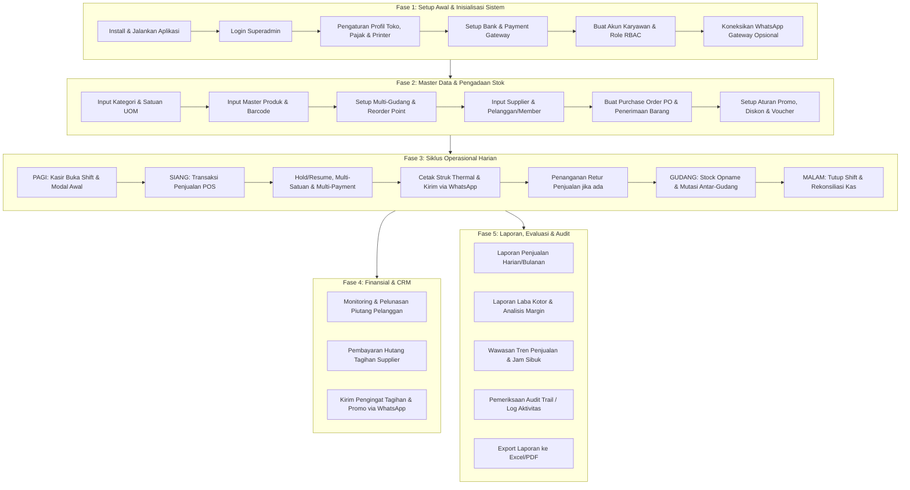
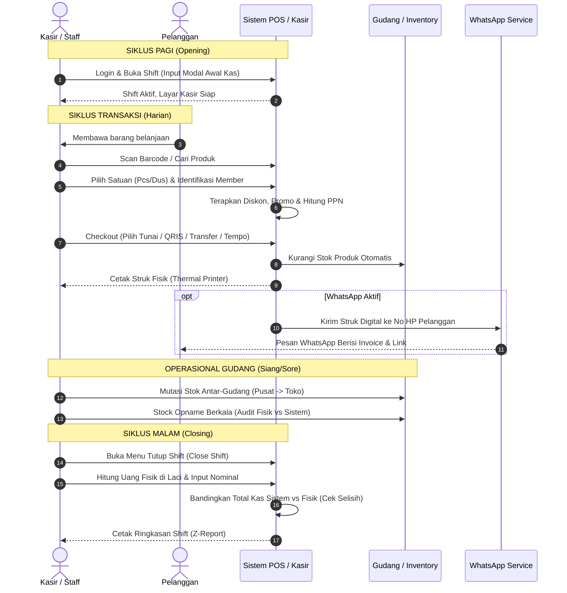
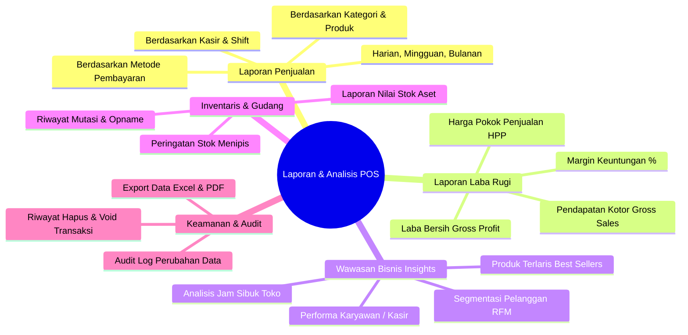

# Panduan Simulasi & Urutan Penggunaan Point of Sales

Dokumen ini berisi panduan alur kerja (*end-to-end simulation guide*) operasional sistem POS, mulai dari inisialisasi awal (*setup*), master data, kegiatan operasional harian kasir dan gudang, hingga manajemen finansial dan pelaporan bisnis.

---

## 🗺️ Peta Alur Operasional (End-to-End Workflow)



---

## 🛠️ Fase 1: Setup Awal & Inisialisasi Sistem (One-Time Setup)

Tahap ini dilakukan pertama kali saat sistem selesai di-deploy atau sebelum operasional toko dimulai.

### 1. Menjalankan Server & Environment
Pastikan server backend, frontend build, dan service pendukung sudah aktif:
```bash
# Salin konfigurasi & install dependency
cp .env.example .env
composer install && npm install
php artisan key:generate
php artisan migrate --seed
php artisan storage:link

# Jalankan service utama (dua terminal)
npm run dev          # Terminal 1: Vite Frontend HMR
php artisan serve    # Terminal 2: Laravel Backend Server (port 8000)

# (Opsional) Jalankan WhatsApp Gateway jika ingin kirim struk/notif otomatis
cd whatsapp-service && npm install && npm start   # Terminal 3: Port 3001
```

### 2. Login Superadmin Pertama Kali
- Buka browser ke `http://localhost:8000`
- Akun Default Superadmin:
  - **Email**: `admin@mail.com`
  - **Password**: `password`

### 3. Konfigurasi Profil Toko & Legalitas
Buka menu **Pengaturan (Settings)** di sidebar:
1. **Profil Toko (`/dashboard/settings/store`)**:
   - Isi Nama Bisnis, Alamat Lengkap, No. Telepon, dan Email toko.
   - Unggah Logo Toko (akan tercetak pada struk PDF/Thermal).
   - Atur teks Header dan Footer struk (misal: *"Terima kasih atas kunjungan Anda"*).
   - Tentukan **Target Penjualan Bulanan** untuk monitoring dashboard KPI.
2. **Pajak & Legalitas (`/dashboard/settings/tax`)**:
   - Tentukan apakah harga sudah termasuk pajak (*Tax Inclusive*) atau belum (*Tax Exclusive*).
   - Isi tarif PPN (misal: `11%` atau `12%`), NPWP, dan NIB perusahaan jika ada.
3. **Pengaturan Printer Struk (`/dashboard/settings/printer`)**:
   - Pilih jenis koneksi: **Browser Print**, **WebUSB**, **Network (Ethernet/IP)**, atau **Bluetooth**.
   - Tentukan ukuran lebar kertas: **58mm** atau **80mm**.
   - Lakukan uji cetak (*Test Print*).

### 4. Setup Pembayaran & Rekening Bank
1. **Metode Pembayaran (`/dashboard/settings/payments`)**:
   - Aktifkan metode: Tunai (*Cash*), Transfer Bank, QRIS, Midtrans, atau Xendit.
   - Masukkan *Server Key* & *Client Key* jika menggunakan payment gateway otomatis.
2. **Akun Bank (`/dashboard/settings/bank-accounts`)**:
   - Daftarkan rekening penerimaan toko (misal: BCA, Mandiri, BRI) beserta nomor rekening dan atas nama.

### 5. Manajemen Hak Akses Karyawan (RBAC)
Buka menu **Users & Roles**:
1. **Roles (`/dashboard/roles`)**:
   - Review peran bawaan: `Super Admin`, `Admin`, `Cashier`, `Warehouse Staff`, `Accountant`.
   - Konfigurasikan permission spesifik sesuai pembagian tugas.
2. **Users (`/dashboard/users`)**:
   - Daftarkan akun untuk setiap kasir dan staff gudang.
   - Contoh akun default kasir: `cashier@gmail.com` / `password`.

### 6. Aktivasi WhatsApp Gateway (Opsional)
Buka menu **Settings > WhatsApp (`/dashboard/settings/whatsapp`)**:
- Klik tombol **Hubungkan WhatsApp**.
- Pindai (*scan*) QR Code yang muncul menggunakan aplikasi WhatsApp di smartphone kasir/toko.
- Status akan berubah menjadi **Connected**.

---

## 📦 Fase 2: Master Data & Pengadaan Stok (Inventory & Master Setup)

Sebelum kasir dapat melakukan transaksi, data barang, satuan, supplier, dan stok awal harus diisi.

### 1. Satuan & Konversi Unit (UOM)
Buka menu **Master Data > Satuan (`/dashboard/units`)**:
- Daftarkan satuan dasar dan turunan (misal: `Pcs`, `Dus`, `Pack`, `Lusin`, `Kg`, `Gram`).
- Tentukan rasio konversi (contoh: `1 Dus = 24 Pcs`, `1 Pack = 10 Pcs`).

### 2. Kategori & Master Produk
Buka menu **Produk (`/dashboard/products`)**:
- **Kategori (`/dashboard/categories`)**: Buat klasifikasi barang (contoh: *Makanan Ringan*, *Minuman Dingin*, *Sembako*, *Elektronik*).
- **Input Produk Baru**:
  - Nama Produk, SKU, dan Barcode (dapat di-scan langsung atau di-generate otomatis).
  - Harga Pokok Pembelian (HPP / Buy Price) dan Harga Jual (Sell Price).
  - Stok Minimum (*Reorder Point*) sebagai batas peringatan *Low Stock Alert*.
  - Atur satuan multi-UOM (misal: harga beli per Dus, harga jual bisa per Pcs dan per Dus).
  - Unggah foto produk.
- **Import Massal**: Jika memiliki ribuan data barang, gunakan fitur **Import Excel/CSV (`/dashboard/products/import`)** dengan mengunduh template yang disediakan.

### 3. Setup Multi-Gudang (Warehouse)
Buka menu **Gudang (`/dashboard/warehouses`)**:
- Buat lokasi penyimpanan fisik: misal `Gudang Pusat`, `Toko Utama (Display)`, `Cabang 2`.

### 4. Master Supplier & Pelanggan / Member
1. **Supplier (`/dashboard/suppliers`)**:
   - Daftarkan nama distributor/pemasok, no HP, alamat, dan termin pembayaran default (misal: Net 30 hari).
2. **Pelanggan & Member (`/dashboard/customers`, `/dashboard/members`)**:
   - Daftarkan pelanggan loyal untuk program membership.
   - Tentukan Tier Member (*Silver*, *Gold*, *Platinum*) yang otomatis memberikan potongan harga atau poin reward.

### 5. Pengadaan Barang Masuk (Purchasing Chain)
Untuk mengisi stok secara profesional dan tercatat rapi:
1. **Purchase Order (`/dashboard/purchase-orders`)**: Buat draft pesanan pembelian ke supplier.
2. **Penerimaan Barang / Goods Receiving (`/dashboard/goods-receivings`)**:
   - Ketika barang fisik tiba di gudang, lakukan pencocokan kuantitas yang diterima dengan PO.
   - Konfirmasi penerimaan: **Stok gudang akan bertambah otomatis**, dan sistem mencatat **Hutang Usaha (Payables)** jika pembelian dilakukan secara tempo/kredit.

### 6. Setup Aturan Promo & Diskon (Opsional)
Buka menu **Promosi (`/dashboard/promotions`, `/dashboard/vouchers`)**:
- Buat aturan diskon (misal: *"Beli 2 Diskon 10%"*, diskon nominal, atau voucher diskon tertentu).

---

## ⚡ Fase 3: Siklus Kegiatan Operasional Harian (Daily Routine)

Alur kerja harian yang dijalankan oleh Kasir dan Staff Toko setiap hari kerja.



### 1. Pagi Hari: Pembukaan Shift Kasir (Shift Opening)
Sebelum kasir melayani transaksi pertama:
1. Kasir login menggunakan akun kasir (`cashier@gmail.com`).
2. Masuk ke halaman **Kasir POS (`/pos`)**.
3. Sistem secara otomatis menampilkan modal **Buka Shift Kasir** (*Active Shift Guard*).
4. Kasir memasukkan **Modal Kas Awal** (*Opening Cash Float*), misalnya: `Rp 200.000` (uang receh/kembalian di laci kas).
5. Klik **Buka Shift**. Layar kasir kini aktif dan siap menerima transaksi.

### 2. Operasional Penjualan (POS Checkout)
Ketika pembeli datang ke kasir:
1. **Input Produk**:
   - Gunakan barcode scanner (USB/Bluetooth), kamera HP (fitur Mobile POS), atau ketik nama/SKU di kolom pencarian.
   - Pilih satuan produk jika multi-satuan (contoh: pembeli ingin beli 1 Dus atau 2 Pcs).
2. **Pilih Pelanggan / Member**:
   - Ketik nama atau no HP pelanggan.
   - Jika terdaftar sebagai member, diskon khusus tier member atau poin loyalitas akan otomatis terhitung.
3. **Fitur Khusus saat Kasir Sibuk**:
   - **Tahan Transaksi (*Hold Cart*)**: Jika pelanggan lupa mengambil barang tambahan, kasir dapat menahan keranjang sementara dan melayani antrean berikutnya.
   - **Lanjutkan Transaksi (*Resume Cart*)**: Panggil kembali keranjang yang ditahan saat pelanggan sudah kembali.
4. **Proses Pembayaran (Checkout)**:
   - Klik tombol **Bayar / Checkout**.
   - Pilih metode pembayaran:
     - **Tunai (*Cash*)**: Masukkan nominal uang yang diterima, sistem otomatis menghitung nominal kembalian (*Change*).
     - **QRIS / Payment Gateway**: Sistem menampilkan QR code dinamis untuk di-scan pelanggan.
     - **Transfer Bank**: Pilih bank tujuan toko.
     - **Piutang / Kasbon (*Tempo*)**: Khusus pelanggan terdaftar dengan batasan plafon kredit dan tanggal jatuh tempo.
     - **Multi-Payment / Split**: Sebagian tunai dan sebagian transfer/voucher.
   - Masukkan catatan transaksi jika diperlukan.
   - Klik **Selesaikan Transaksi**.
5. **Output Struk Transaksi**:
   - Struk fisik otomatis dicetak melalui **Printer Termal (58mm/80mm)**.
   - Jika nomor WhatsApp pelanggan terisi, sistem otomatis mengirimkan **Struk Digital & PDF Invoice via WhatsApp**.

### 3. Penanganan Retur Penjualan (Jika Ada Komplain)
Buka menu **Retur Penjualan (`/dashboard/sales-returns`)**:
- Jika ada pembeli yang mengembalikan barang cacat/rusak:
  - Cari nomor nota transaksi asal.
  - Pilih produk dan jumlah yang diretur.
  - Tentukan kompensasi: **Pengembalian Uang Tunai (*Refund Cash*)** atau **Saldo Belanja Toko (*Store Credit*)**.
  - Sistem otomatis menyesuaikan stok dan catatan kas/laba.

### 4. Operasional Gudang Harian
- **Mutasi Stok Antar-Gudang (`/dashboard/stock-transfers`)**:
  - Pindahkan barang dari *Gudang Penyimpanan Pusat* ke rak pajangan *Toko Depan*.
- **Stock Opname Harian / Rutin (`/dashboard/stock-opnames`)**:
  - Staff gudang melakukan penghitungan fisik barang acak/harian.
  - Input jumlah fisik sebenarnya, sistem mencatat selisih (*Loss / Surplus*) dan memperbarui nilai inventaris secara akurat.

### 5. Malam Hari: Penutupan Shift Kasir (Shift Closing & Reconciliation)
Saat pergantian shift atau toko tutup:
1. Kasir membuka menu **Tutup Shift (`/dashboard/cashier-shifts`)**.
2. Kasir menghitung fisik seluruh uang kertas dan koin yang ada di laci kasir (*drawer*).
3. Masukkan nominal **Uang Fisik Akhir** ke dalam sistem.
4. Sistem membandingkan perhitungan sistem (Modal Awal + Penjualan Tunai - Retur Tunai) dengan uang fisik yang diinput:
   - **Cocok (*Balanced*)**: Tidak ada selisih.
   - **Kurang (*Shortage*) / Lebih (*Over*)**: Kasir wajib mengisi keterangan alasan selisih.
5. Klik **Tutup Shift**.
6. Cetak **Laporan Ringkasan Shift (Z-Report / Shift Summary)** sebagai bukti serah terima kas ke manajer/pemilik toko.

---

## 💰 Fase 4: Manajemen Finansial & Piutang/Hutang (Receivables & Payables)

Aktivitas berkala oleh bagian keuangan (*Finance/Admin*):

### 1. Monitoring & Pelunasan Piutang Pelanggan (Receivables)
Buka menu **Piutang Usaha (`/dashboard/receivables`)**:
- Pantau daftar piutang berumur (*Aging Schedule*: 0–30 hari, 31–60 hari, >90 hari).
- Lihat status transaksi yang belum lunas.
- Saat pelanggan membayar:
  - Klik **Catat Pembayaran / Konfirmasi Pembayaran**.
  - Masukkan nominal cicilan / pelunasan penuh.
  - Kirim pengingat tagihan otomatis via WhatsApp bagi piutang yang mendekati atau melewati jatuh tempo.
- **Customer Portal**: Pelanggan juga dapat membuka link faktur publik mereka untuk mengecek rincian tagihan dan melakukan pembayaran mandiri.

### 2. Pembayaran Hutang Supplier (Payables)
Buka menu **Hutang Usaha (`/dashboard/payables`)**:
- Pantau jatuh tempo faktur dari supplier (hasil dari penerimaan PO di Fase 2).
- Catat pembayaran transfer keluar ke rekening supplier agar status hutang ter-update lunas.

---

## 📊 Fase 5: Evaluasi, Audit & Laporan Bisnis (Reporting & Analytics)

Dilakukan oleh Manajer, Owner, atau Tim Akuntansi untuk menganalisis performa bisnis.



### 1. Laporan Penjualan (`/dashboard/reports/sales`)
- Filter berdasarkan rentang tanggal, kasir, metode pembayaran, atau status transaksi.
- Menampilkan grafik tren transaksi harian, total omzet kotor, potongan diskon, dan total PPN yang dipungut.

### 2. Laporan Laba Rugi / Gross Profit (`/dashboard/reports/profit`)
- Menampilkan perbandingan antara **Total Penjualan (Revenue)** dengan **Harga Pokok Penjualan (COGS / HPP)**.
- Menghitung **Laba Kotor (Gross Profit)** dan persentase margin keuntungan per produk dan kategori barang.

### 3. Wawasan Lanjutan & Analytics (`/dashboard/reports/insights`)
- **Produk Terlaris (*Top Selling Products*)**: Mengetahui produk yang menyumbang omzet dan kuantitas terbanyak.
- **Analisis Jam Sibuk (*Peak Hours Analysis*)**: Mengetahui jam-jam paling ramai pelanggan untuk optimalisasi jadwal kerja kasir.
- **Performa Kasir (*Cashier Performance*)**: Mengetahui efisiensi dan kecepatan transaksi setiap staf kasir.

### 4. Segmentasi CRM Pelanggan (`/dashboard/crm/segments`)
- Pengelompokan pelanggan berdasarkan analisis RFM (*Recency, Frequency, Monetary*):
  - *Pelanggan Loyal / VIP*: Sering belanja dengan nominal besar.
  - *Pelanggan Pasif / Berisiko Hilang*: Sudah lama tidak bertransaksi.
- Kirim pesan promosi terarah via WhatsApp untuk menarik kembali pelanggan pasif.

### 5. Audit Trail & Log Keamanan (`/dashboard/audit-logs`)
- Memeriksa jejak rekaman seluruh aktivitas sensitif yang dilakukan oleh staf, seperti:
  - Pembatalan/Void transaksi.
  - Perubahan harga atau stok produk manual.
  - Penghapusan data master atau penyesuaian hak akses role.

### 6. Export Laporan (`/dashboard/export`)
- Seluruh laporan dapat diekspor ke dalam format:
  - **Excel / Spreadsheet (.xlsx)**
  - **CSV (.csv)**
  - **Dokumen Cetak / Faktur PDF Resmi**

---

## 📌 Ringkasan Checklist Harian (Daily Quick Reference)

| Waktu | Penanggung Jawab | Aktivitas Utama | Menu / Halaman Terkait |
|---|---|---|---|
| **07:30 - Pagi** | Kasir | Buka Shift, input modal awal kas (Float Cash) | `/pos` |
| **08:00 - Pagi** | Staff Gudang | Terima barang supplier (Goods Receiving), cek fisik | `/dashboard/goods-receivings` |
| **08:00 - 21:00** | Kasir | Scan barcode, layani transaksi, cetak & kirim struk WA | `/pos` |
| **14:00 - Siang** | Staff Gudang | Mutasi stok dari gudang ke toko, cek stok menipis | `/dashboard/stock-transfers` |
| **16:00 - Sore** | Finance | Cek piutang jatuh tempo, kirim reminder WA | `/dashboard/receivables` |
| **21:00 - Malam** | Kasir | Hitung uang fisik laci kas, tutup shift, cetak Z-Report | `/dashboard/cashier-shifts` |
| **21:30 - Malam** | Owner / Manajer | Review laporan omzet, laba kotor, dan audit harian | `/dashboard/reports/sales` |

---

*Kembali ke indeks dokumentasi: [`docs/README.md`](file:///home/sandi/workspace/point-of-sales/docs/README.md)*
