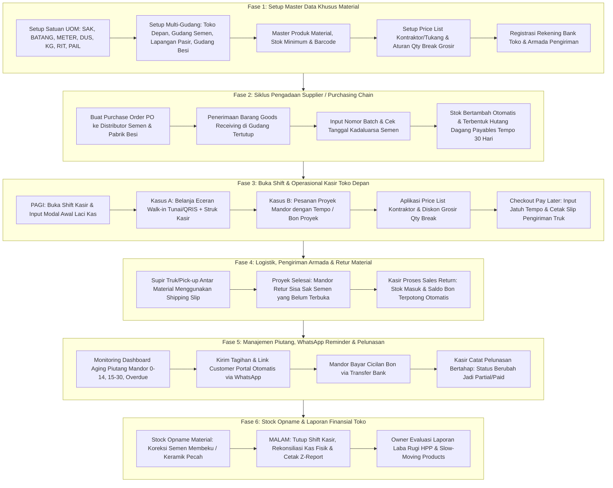

# Panduan Simulasi & Urutan Operasional Toko Bangunan (Building Materials POS)

Dokumen ini adalah panduan alur kerja operasional lengkap (*end-to-end operational simulation guide*) yang disesuaikan khusus untuk **Toko Bahan Bangunan, Besi, dan Material (Building Materials Store)**.

Toko bangunan memiliki karakteristik unik yang membedakannya dari retail umum:
1. **Multi-Satuan & Konversi Bertingkat (Multi-UOM)**: Semen (Sak/Kg), Pipa PVC & Besi (Batang/Meter/Lonjor), Paku (Dus/Kg/Ons), Pasir (Rit/M3/Karung), Cat (Pail/Galon/Kaleng).
2. **Transaksi Bon Proyek / Tempo (Pay Later & Receivables)**: Kontraktor dan mandor biasa mengambil material di awal dan membayar bertahap sesuai progres proyek.
3. **Multi-Gudang Terpisah**: Toko depan (alat teknik & display), Gudang semen/mortar tertutup, Gudang besi & atap, serta Lapangan terbuka (pasir, hebel, bata).
4. **Rantai Pengadaan Distributor (Purchasing & Payables)**: Order semen ke pabrik, penerimaan barang dengan nomor batch/tanggal produksi, dan hutang dagang tempo 30-60 hari.
5. **Logistik Armada Toko**: Pengiriman barang berat menggunakan pick-up/truk dengan ongkos kirim dan slip pengiriman (*shipping slip*).
6. **Retur Sisa Proyek**: Pengembalian sisa sak semen atau kelebihan keramik yang langsung memotong saldo bon mandor.

---

## 🗺️ Peta Alur Operasional Toko Bangunan



---

## 🎭 Skenario Kasus Bisnis (*Role-Play Scenario*)

**Entitas Bisnis:** **"TB Sinar Maju Material & Besi"**  
Alamat: Jl. Raya Industri No. 45, Cikarang, Bekasi  
Spesialisasi: Retail & Grosir Semen, Besi Beton, Baja Ringan, Pipa PVC, Cat Tembok, Pasir & Alat Teknik.

### Profil Karakter Pengguna (*Actors & Roles*):
| Aktor | Role & Penempatan | Kredensial Login | Tugas Pokok di Toko Bangunan |
|---|---|---|---|
| **Haji Ridwan** | `Super Admin` / Pemilik Toko | `admin@mail.com` / `password` | Mengawasi laporan laba rugi HPP, menyetujui plafon kredit bon proyek, memantau konsolidasi multi-gudang. |
| **Mas Joko** | `Admin` / Kepala Gudang | `admin@mail.com` / `password` | Mengelola PO semen/besi, memeriksa penerimaan barang distributor (*Goods Receiving*), mengatur mutasi antar-gudang dan stock opname. |
| **Siti Rahma** | `Cashier` / Kasir Toko Depan | `cashier@gmail.com` / `password` | Buka/tutup shift kasir, transaksi barcode alat teknik, memilih multi-satuan (sak/kg/lonjor), membuat nota bon `pay_later`, cetak struk/slip pengiriman. |
| **Budi Supri** | `Driver` / Logistik Toko | *(Fisik)* | Membawa armada pick-up/truk engkel mengantar material ke alamat proyek berbekal Surat Jalan/Slip Pengiriman. |
| **Mandor Yanto** | `Member` / Kontraktor Langganan | *Member ID: 081298765432* | Mengambil material bertahap untuk proyek renovasi rumah via tempo bon, melunasi cicilan via transfer bank. |

---

## 🛠️ Fase 1: Setup Master Data Khusus Material Bangunan

Langkah awal untuk memastikan sistem siap menangani barang bermassa berat, berukuran panjang, dan multi-satuan.

### 1. Pendaftaran Master Satuan & Faktor Konversi (UOM)
Masuk ke menu **Master Data > Satuan (`/dashboard/units`)**:
Daftarkan satuan-satuan khas toko bangunan:

| Kode Unit | Nama Unit | Simbol | Keterangan Penggunaan |
|---|---|---|---|
| `PCS` | Pieces / Buah | pcs | Alat teknik, fitting pipa (knee, socket, tee), kuas, gembok |
| `KG` | Kilogram | kg | Satuan dasar untuk paku curah, kawat bendrat, semen kiloan |
| `METER` | Meter | m | Satuan dasar untuk selang, kabel listrik, talang air |
| `SAK` | Sak / Zak | sak | Satuan kemasan semen (40 kg atau 50 kg) |
| `BATANG` | Batang / Lonjor | btg | Pipa PVC (1 batang = 4 meter), Besi beton (1 batang = 12 meter) |
| `DUS` | Dus / Box | dus | Keramik lantai (1 dus = 1.44 m2), paku kardusan (1 dus = 10 kg) |
| `PAIL` | Pail Besar | pail | Cat tembok eksterior/interior ukuran besar (20 kg / 25 kg) |
| `RIT` | Ritase Truk | rit | Pasir pasang, batu split (1 rit pick-up = $\pm 1.5\text{ m}^3$, truk engkel = $\pm 4\text{ m}^3$) |
| `LEMBAR` | Lembar | lbr | Papan gypsum, triplek, kalsiboard, seng seng gelombang |

---

### 2. Setup Multi-Gudang Material (*Multi-Warehouse*)
Masuk ke menu **Pengaturan > Gudang / Cabang (`/dashboard/settings/warehouses`)**:
Pisahkan penempatan barang berdasarkan jenis resiko dan karakteristik fisiknya:

1. **`Gudang Toko Depan / Display`** (`WH-RETAIL`):
   - Lokasi kasir toko depan: perkakas tangan, fitting pipa, stopkontak, lem, baut, paku kaleng, cat kaleng kecil.
2. **`Gudang Semen & Drymix (Indoor)`** (`WH-SEMEN`):
   - Gudang tertutup terpal/palet kayu: Semen Gresik 40kg, Semen Tiga Roda 50kg, Mortar perekat bata ringan, Semen instan, Gypsum.
3. **`Gudang Besi & Baja Ringan`** (`WH-BESI`):
   - Rak racking besi: Besi beton ulir 10mm, besi polos 8mm, hollow plafon 4x4, baja ringan c75, seng spandek.
4. **`Lapangan Terbuka / Area Curah`** (`WH-CURAH`):
   - Area outdoor belakang: Pasir pasang, batu split, bata merah bakar, bata ringan (hebel), buis beton.

---

### 3. Master Produk & Konversi Satuan (*Product Units Pivot*)
Masuk ke menu **Master Data > Produk (`/dashboard/products`)**:

#### Contoh Produk A: Semen Portland Gresik 40 Kg
- **Nama Produk**: `Semen Gresik PCC 40 Kg`
- **SKU**: `SMN-GRS-40` | **Kategori**: `Semen & Mortar`
- **Base Unit**: `KG` (Stok dihitung dalam kg, misalnya stok total: 8.000 kg = 200 sak)
- **Multi-Satuan (`product_units`)**:
  - Satuan Tambahan: `SAK`
  - **Faktor Konversi**: `40.0000` (1 Sak = 40 Kg)
  - **Harga Beli Satuan Sak**: Rp 58.000
  - **Harga Jual Satuan Sak**: Rp 65.000 (Eceran)
  - **Harga Jual Satuan Kg (Ecer Sobekan)**: Rp 2.000 / kg

#### Contoh Produk B: Pipa PVC Wavin AW 3/4"
- **Nama Produk**: `Pipa PVC Rucika AW 3/4 inch`
- **SKU**: `PPA-RCK-075` | **Kategori**: `Plumbing & Pipa`
- **Base Unit**: `METER`
- **Multi-Satuan (`product_units`)**:
  - Satuan Tambahan: `BATANG`
  - **Faktor Konversi**: `4.0000` (1 Batang = 4 Meter)
  - **Harga Beli Satuan Batang**: Rp 32.000
  - **Harga Jual Satuan Batang**: Rp 42.000
  - **Harga Jual Per Meter**: Rp 12.000 / meter

#### Contoh Produk C: Paku Kayu Usuk 7 cm
- **Nama Produk**: `Paku Kayu Ukuran 7 cm (Curah & Dus)`
- **SKU**: `PKU-KYU-07` | **Kategori**: `Baut & Paku`
- **Base Unit**: `KG`
- **Multi-Satuan (`product_units`)**:
  - Satuan Tambahan: `DUS` (Faktor: 10.0000 / 1 Dus = 10 Kg)
  - **Harga Beli Dus**: Rp 150.000
  - **Harga Jual Dus**: Rp 180.000
  - **Harga Jual Kiloan**: Rp 20.000 / kg

---

### 4. Setup Price List Khusus Tukang & Diskon Grosir (*Qty Break*)

#### A. Price List Pelanggan Kontraktor
Masuk ke menu **Promosi & Harga > Price List (`/dashboard/price-lists`)**:
- Buat daftar harga: **`Daftar Harga Mandor & Kontraktor`**
- Target Segment: `Member / Kontraktor`
- Aturan Harga Khusus:
  - `Semen Gresik PCC 40 Kg (Satuan Sak)`: Khusus Kontraktor Rp 62.500 (Potongan Rp 2.500 dari harga umum Rp 65.000).
  - `Besi Beton 10mm Ulir (Satuan Batang)`: Khusus Kontraktor Rp 85.000 (Harga umum Rp 89.000).

#### B. Promo Diskon Grosir (*Qty Break Promo*)
Masuk ke menu **Promosi & Harga > Aturan Harga (`/dashboard/pricing-rules`)**:
- Nama Rule: **`Grosir Pembelian Semen $\ge 50$ Sak`**
- Jenis Rule: `Quantity Break`
- Syarat Minimal Qty: `50` (satuan Sak)
- Diskon: Potongan Rp 1.500 per sak otomatis saat kasir menginput belanja $\ge 50$ sak.

---

## 🏗️ Fase 2: Siklus Pengadaan Masuk (Purchasing Chain)

Toko bangunan memesan material dalam volume besar langsung ke distributor pabrikan semen dan besi.

```
Purchase Order (PO) ──> Pengiriman Pabrik ──> Goods Receiving (Cek Batch Semen) ──> Hutang Usaha (Payables 30 Hari)
```

### Langkah 1: Buat Purchase Order (PO)
1. Buka menu **Pembelian > Purchase Order (`/dashboard/purchase-orders`)** $\rightarrow$ Klik **Buat PO**.
2. **Pilih Supplier**: `PT Distributor Semen Sejahtera`.
3. **Gudang Tujuan**: `Gudang Semen & Drymix` (`WH-SEMEN`).
4. **Daftar Barang**:
   - `Semen Gresik PCC 40 Kg`: Qty = `200` Sak @ Rp 58.000 = Rp 11.600.000.
5. Simpan draft $\rightarrow$ Klik **Place Order** (Nomor dokumen otomatis: `PO-20260904-0001`).

### Langkah 2: Penerimaan Barang (*Goods Receiving*) di Gudang
Saat truk fuso pengangkut semen tiba di gudang:
1. Buka menu **Pembelian > Penerimaan Barang (`/dashboard/goods-receivings`)** $\rightarrow$ Klik **Terima Barang PO**.
2. Pilih PO nomor `PO-20260904-0001`.
3. Cek fisik muatan: 200 sak semen turun ke gudang dalam kondisi kering dan rapi.
4. **Input Kontrol Kualitas & Batch**:
   - **Nomor Surat Jalan Pabrik**: `SJ-DIST-88910`
   - **Nomor Batch**: `BATCH-SG-202609A`
   - **Tanggal Kedaluwarsa Semen**: Isi 3 bulan ke depan (misal: 30 November 2026).  
     *(Penting: Semen yang tersimpan lebih dari 3 bulan beresiko membeku terkena kelembapan udara).*
5. Klik **Simpan Penerimaan Barang**.

### Dampak Otomatis Sistem:
- **Stok Fisik**: Bertambah 200 sak ($8.000\text{ kg}$) di `WH-SEMEN`.
- **Hutang Dagang (*Payables*)**: Terbentuk faktur hutang otomatis di menu **Keuangan > Hutang Supplier (`/dashboard/payables`)** senilai Rp 11.600.000 dengan jatuh tempo tempo 30 hari.

---

## 🛒 Fase 3: Operasional Harian Kasir Toko Depan

### 1. Buka Shift Kasir (Pagi Hari - 07:30 WIB)
1. Kasir Siti login ke akun kasir: `cashier@gmail.com` / `password`.
2. Klik menu **Point of Sale (`/pos`)**.
3. Sistem memunculkan modal **Buka Shift Kasir**:
   - **Gudang Penugasan**: `Gudang Toko Depan / Display` (`WH-RETAIL`).
   - **Modal Awal Kas (Float Cash)**: Masukkan `Rp 500.000` (uang pecahan kembalian).
   - Klik **Buka Shift Kasir**.

---

### 2. Transaksi A: Belanja Eceran Walk-in (Tunai / QRIS)
*Skenario: Tukang servis rumahan membeli perlengkapan pipa darurat.*

1. **Cari Produk di Kasir POS**:
   - Scan barcode atau ketik: `Pipa PVC Rucika AW 3/4`
   - Di baris cart, pada pilihan satuan, klik dropdown satuan: pilih **`BATANG`** $\rightarrow$ Qty: `2` (Harga otomatis Rp 42.000 x 2 = Rp 84.000).
   - Scan barcode: `Knee PVC 3/4 inch` $\rightarrow$ Qty: `4` @ Rp 3.500 = Rp 14.000.
   - Scan barcode: `Lem Pipa PVC Kaleng Kecil` $\rightarrow$ Qty: `1` @ Rp 12.000 = Rp 12.000.
   - Ketik: `Paku Kayu 7 cm` $\rightarrow$ pilih satuan **`KG`** $\rightarrow$ Qty: `2` @ Rp 20.000 = Rp 40.000.
2. **Subtotal Belanja**: Rp 150.000.
3. **Pembayaran**:
   - Klik **Bayar (Checkout)**.
   - Pilih metode pembayaran **Tunai (Cash)**: Kasir menginput uang diterima `Rp 200.000`.
   - Sistem menampilkan kembalian: `Rp 50.000`.
4. **Cetak Struk**:
   - Printer thermal 58mm/80mm mencetak struk kasir dengan nama barang, satuan, dan ucapan terima kasih.

---

### 3. Transaksi B: Belanja Proyek Mandor (Bon Proyek / Tempo & Pengiriman Pick-up)
*Skenario: Mandor Yanto memesan material untuk proyek renovasi rumah Bapak Hendra di Perumahan Griya Indah. Mandor Yanto mengambil barang secara tempo (bon proyek) dan meminta dikirim menggunakan armada pick-up toko.*

```
Input Pesanan Proyek ──> Pilih Member Kontraktor ──> Input Ongkos Kirim ──> Pilih Pay Later (Tempo) ──> Cetak Invoice A4 + Slip Pengiriman Truk
```

1. **Pilih Pelanggan Member**:
   - Pada kolom pelanggan kasir POS, cari: **`Mandor Yanto (081298765432)`**.
   - Sistem otomatis mengaktifkan **Price List Kontraktor**.
2. **Input Daftar Material**:
   - `Semen Gresik PCC 40 Kg`:
     - Pilih satuan: **`SAK`**
     - Masukkan Qty: **`50`**
     - *Efek Harga*: Karena Mandor Yanto berstatus member kontraktor dan membeli $\ge 50$ sak, sistem otomatis menerapkan harga grosir khusus Rp 61.000/sak (Total: Rp 3.050.000).
   - `Pipa PVC Rucika AW 3/4`: Satuan **`BATANG`** $\rightarrow$ Qty: `10` @ Rp 40.000 = Rp 400.000.
   - `Paku Kayu 7 cm`: Satuan **`DUS`** $\rightarrow$ Qty: `1` @ Rp 175.000 = Rp 175.000.
3. **Input Biaya Pengiriman Armada Toko (*Shipping Cost*)**:
   - Di panel checkout kasir, masukkan ongkos kirim pick-up: **`Rp 75.000`**.
4. **Pilih Metode Pembayaran Tempo (*Pay Later*)**:
   - Pada pilihan metode bayar, centang **Nota Bon Proyek (Pay Later)**.
   - **Tanggal Jatuh Tempo (*Due Date*)**: Masukkan tanggal 14 hari ke depan (misal: `18 September 2026`).
   - **Catatan Alamat Pengiriman**: *"Kirim ke Jl. Melati Blok C2 No. 12, Perumahan Griya Indah (Up: Mandor Yanto - 081298765432)"*.
5. **Konfirmasi & Selesaikan Transaksi**:
   - Grand Total Transaksi: **Rp 3.700.000**.
   - Klik **Simpan Transaksi**.
6. **Cetak Dokumen Pengiriman & Invoice**:
   - **Cetak Invoice Transaksi (A4 PDF)**: Disimpan untuk arsip penagihan kantor.
   - **Cetak Slip Pengiriman / Surat Jalan (*Shipping Slip*)**:
     Kasir mencetak dokumen via tombol `Cetak Shipping Label / Slip Pengiriman` (`/dashboard/transactions/{invoice}/shipping`).  
     Slip ini memuat barcode invoice, nama penerima, alamat proyek, rincian 50 sak semen, 10 pipa, 1 dus paku, serta kolom tanda tangan penerima material di lapangan.
   - Kasir menyerahkan Slip Pengiriman ke **Budi Supri (Driver Pick-up)**.

---

## 🚚 Fase 4: Logistik, Pengiriman Armada & Retur Material

### 1. Pengantaran Barang oleh Driver
1. Budi Supri memuat 50 sak semen dari `Gudang Semen` dan pipa dari `Gudang Display`.
2. Driver meluncur ke lokasi proyek Griya Indah.
3. Mandor Yanto memeriksa jumlah sak semen dan menandatangani lembar tanda terima Slip Pengiriman.

---

### 2. Retur Sisa Material Proyek (*Sales Return*)
*Skenario: Tiga hari kemudian, pengecoran lantai selesai. Ternyata ada sisa 4 sak semen yang masih utuh, bersih, dan belum sobek. Mandor Yanto membawa kembali 4 sak semen tersebut ke toko untuk mengurangi nilai bon proyeknya.*

1. Kasir Siti membuka menu **Penjualan > Retur Penjualan (`/dashboard/sales-returns`)** $\rightarrow$ Klik **Buat Retur**.
2. Masukkan nomor faktur transaksi Mandor Yanto (contoh: `TRX-20260904-0002`).
3. Sistem memuat rincian belanja faktur tersebut.
4. **Input Item yang Diretur**:
   - Pilih barang: `Semen Gresik PCC 40 Kg`.
   - Qty Retur: Masukkan `4` Sak (Nilai: 4 x Rp 61.000 = Rp 244.000).
   - Alasan Retur: *"Material sisa proyek pengecoran lantai"*.
   - Kondisi Barang: *"Bagus / Layak Jual"*.
5. **Metode Penyelesaian Retur**:
   - Karena transaksi asalnya adalah `pay_later` yang belum lunas, sistem secara otomatis menawarkan opsi: **Potong Saldo Piutang (Koreksi Tagihan Bon)**.
6. Klik **Konfirmasi Retur Penjualan**.

### Dampak Otomatis Sistem:
- **Stok Fisik**: 4 sak semen otomatis kembali menambah stok di gudang semen.
- **Saldo Piutang Mandor**: Saldo bon Mandor Yanto langsung terpotong dari semula Rp 3.700.000 menjadi **Rp 3.456.000**.
- **Dokumen**: Struk retur resmi dicetak sebagai tanda terima untuk Mandor Yanto.

---

## 💳 Fase 5: Manajemen Piutang, WhatsApp Reminder & Pelunasan

Mengelola piutang adalah pilar krusial toko bangunan agar kas toko tidak macet di proyek kontraktor.

### 1. Monitoring Umur Piutang (*Aging Receivables*)
Owner (Haji Ridwan) membuka menu **Keuangan > Piutang Pelanggan (`/dashboard/receivables`)**:
- Sistem mengelompokkan piutang ke dalam kategori umur:
  - `0 - 14 Hari`: Piutang baru (lancar).
  - `15 - 30 Hari`: Mendekati batas tempo.
  - `> 30 Hari (Overdue)`: Piutang menunggak (ditandai warna merah).
- Terlihat tagihan atas nama **Mandor Yanto**:
  - Total Nota: Rp 3.700.000
  - Koreksi Retur: -Rp 244.000
  - Sisa Piutang Bersih: **Rp 3.456.000**
  - Jatuh Tempo: `18 September 2026` (Status: *Unpaid / Belum Lunas*).

---

### 2. Pengiriman Notifikasi Tagihan Otomatis via WhatsApp
Melalui integrasi WhatsApp Gateway dan modul CRM:
1. Sistem secara otomatis mengirimkan pesan pengingat tagihan berkala (H-3 sebelum jatuh tempo) ke nomor WhatsApp Mandor Yanto:
   ```text
   Halo Mandor Yanto,
   Terima kasih telah mempercayakan kebutuhan material proyek Anda di TB Sinar Maju.

   Mengingatkan nota bon Anda untuk Proyek Griya Indah:
   No. Invoice : TRX-20260904-0002
   Sisa Tagihan: Rp 3.456.000
   Jatuh Tempo : 18 September 2026

   Rincian nota dan opsi pembayaran transfer dapat dilihat melalui tautan resmi:
   https://tbsinarmaju.com/portal/invoice/TRX-20260904-0002
   ```

---

### 3. Pelunasan Bertahap (Cicilan Piutang)
*Skenario: Mandor Yanto mendapat pembayaran termin pertama dari pemilik rumah dan mentransfer cicilan sebesar Rp 2.000.000 ke rekening BCA toko.*

1. Kasir Siti membuka menu **Keuangan > Piutang Pelanggan (`/dashboard/receivables`)**.
2. Klik pada tagihan Mandor Yanto $\rightarrow$ Klik tombol **Bayar Piutang**.
3. **Formulir Pembayaran Piutang**:
   - **Jumlah Bayar**: Masukkan `Rp 2.000.000`.
   - **Metode Pembayaran**: `Transfer Bank`.
   - **Rekening Tujuan**: Pilih `Bank BCA a/n TB Sinar Maju`.
   - **Catatan / No. Referensi Transfer**: `TRF-BCA-992019`.
4. Klik **Simpan Pembayaran**.

### Dampak Otomatis Sistem:
- Status piutang otomatis berubah dari `unpaid` menjadi **`partial` (Sebagian)**.
- **Sisa Piutang Terkini**: Menjadi **Rp 1.456.000**.
- Riwayat pembayaran tercatat rapi beserta tanggal, jam, kasir penerima, dan mutasi saldo kas bank toko bertambah Rp 2.000.000.

---

## 🔍 Fase 6: Stock Opname & Penanganan Material Rusak

Di toko bangunan, kerusakan material lumrah terjadi: semen mengeras terkena tetesan air hujan, bata merah pecah, atau seng tertekuk.

### 1. Stock Opname Rutin Gudang Semen
1. Mas Joko (Kepala Gudang) membuka menu **Inventori > Stock Opname (`/dashboard/stock-opnames`)** $\rightarrow$ Klik **Mulai Opname**.
2. Pilih gudang: `Gudang Semen & Drymix` (`WH-SEMEN`).
3. Hitung fisik sak semen di tumpukan palet.
4. **Temuan Lapangan**:
   - Tercatat di sistem: 154 Sak.
   - Ditemukan fisik: 153 Sak dalam kondisi baik, dan **1 Sak semen telah membeku keras** akibat rembesan atap saat hujan lebat.
5. **Input Penyesuaian**:
   - Stok Aktual: `153` Sak.
   - Selisih: `-1` Sak (Minus 1).
   - Alasan Penyesuaian: Pilih **`Damaged / Expired (Barang Rusak/Membeku)`**.
6. Simpan dan selesaikan Opname.

### Dampak Otomatis Sistem:
- Sistem membuat mutasi stok penyesuaian otomatis (*Stock Mutation Adjustment*).
- Kerugian 1 sak semen (senilai HPP Rp 58.000) dialokasikan ke pos beban kerusakan barang dan secara akurat mengoreksi perhitungan laba rugi bulanan.

---

## 🏁 Fase 7: Tutup Shift Kasir, Z-Report & Evaluasi Owner

### 1. Tutup Shift Kasir (Sore Hari - 17:00 WIB)
1. Kasir Siti mengakhiri shift kerjanya di menu **Point of Sale (`/pos`)** $\rightarrow$ Klik **Tutup Shift**.
2. **Rekonsiliasi Kas Laci (Cash Count)**:
   - Kasir menghitung uang fisik di laci:
     - Modal Awal: Rp 500.000
     - Penjualan Tunai Eceran: Rp 150.000
     - Pelunasan Piutang Tunai (jika ada): Rp 0
     - Total Kas Fisik: **Rp 650.000**.
   - Input uang fisik pada sistem: Masukkan `Rp 650.000`.
3. Klik **Konfirmasi Tutup Shift**.
4. Sistem memverifikasi: **Selisih = Rp 0 (Cocok / Seimbang)**.
5. Printer mencetak **Z-Report Shift Kasir** yang memuat ringkasan omzet tunai, omzet bon tempo (*pay later*), mutasi uang, dan jumlah struk yang diterbitkan.

---

### 2. Evaluasi Laporan Finansial Toko Bangunan (Owner Review)
Haji Ridwan membuka menu **Laporan > Laba Rugi (`/dashboard/reports/profits`)** dan **Wawasan Penjualan (`/dashboard/reports/insights`)**:

1. **Laporan Laba Kotor (Profit & Margin HPP)**:
   - Memeriksa selisih harga jual terhadap HPP/COGS per kategori material:
     - Margin Semen & Besi (komoditas perputaran cepat, margin tipis: 5% - 8%).
     - Margin Fitting Pipa, Alat Teknik, dan Cat Tembok (margin tebal: 18% - 30%).
2. **Laporan Slow-Moving Products (Barang Kurang Laku)**:
   - Mendeteksi varian cat warna tertentu atau sambungan pipa ukuran langka yang mengendap di rak lebih dari 60 hari.
   - Owner dapat memutuskan program diskon bundel (*Bundle Promo*) atau cuci gudang sebelum barang berdebu dan kemasan rusak.

---

## 💡 Tips & Trik Penting Operasional Toko Bangunan

1. **Menangani Satuan Pecahan (Contoh: 1.5 Meter Pipa atau 0.5 Kg Paku)**:
   - Karena kolom kuantitas pada keranjang kasir bertipe bilangan bulat (*integer*), gunakan strategi satuan:
     - **Paku / Kawat**: Daftarkan satuan tambahan `1/2 KG` (konversi 0.5) atau `ONS` (konversi 0.1).
     - **Pipa / Selang**: Gunakan base unit `METER` dengan input meter genap, atau daftarkan satuan `POTONGAN 50 CM`.
2. **Plafon Kredit Bon Mandor**:
   - Manfaatkan menu segmentasi member untuk membatasi mandor mana yang berhak mengambil barang dengan metode `pay_later`.
   - Jika mandor masih memiliki nota jatuh tempo yang menunggak (*overdue*), tahan transaksi bon baru sampai cicilan sebelumnya disetor.
3. **Pencatatan Nomor Kendaraan Armada**:
   - Masukkan nomor polisi armada truk/pick-up toko (misal: `B 9812 FYU - Pick-up Suzuki Carry`) pada kolom catatan transaksi kasir agar tercetak jelas di lembar Surat Jalan / Slip Pengiriman.
4. **Menonaktifkan Fitur Resto / Dine-In**:
   - Karena toko bangunan adalah bisnis retail & distribusi, nonaktifkan hak akses (*permission*) `dine-in-access` pada role kasir dan staf gudang agar antarmuka kasir bersih dari fitur meja restoran.
